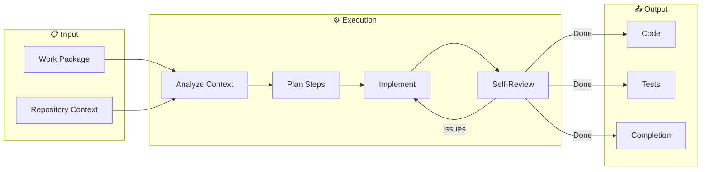

# Dooz-Code

> *An autonomous coder that belongs inside a company.*

---

## ❌ What This Is Not

- Not a code completion tool
- Not a chat-based assistant
- Not an IDE plugin
- Not a productivity enhancer
- Not a copilot

If you want faster autocomplete, **this is not for you**.

---

## ✅ What Problem This Actually Solves

Current AI coding tools fail in one or more ways:

- They optimize for **speed**, not correctness
- They ignore **long-term system health**
- They collapse **decision-making and execution**
- They require **constant human prompting**
- They scale poorly **beyond individual developers**

**Dooz-Code exists to solve execution at organizational scale.**

It turns approved intent into real, production-grade software—without human micromanagement.

---

## 🧠 Mental Model

```
Traditional AI Coder:
    Human: "Write me a login page"
    AI: [generates code immediately]
    
Dooz-Code:
    Approved Work Package → Autonomous Execution → Production Code
```

Dooz-Code does **not** decide *what* to build.
It decides **how to build it correctly**.

---

## 🎯 Core Principles

### 1. Separation of Decision and Execution

Deciding what to build and building it are different authorities. Dooz-Code only executes.

### 2. Autonomy with Boundaries

It runs autonomously—but only inside approved scope. It cannot expand features or change requirements.

### 3. End-to-End Ownership

When it builds something, it owns the whole feature: backend, frontend, tests, configs.

### 4. System-Aware Coding

Code is written with awareness of architecture, dependencies, and future maintenance.

### 5. Open by Default

Core engine is fully open source (Apache 2.0).

---

## 📥 Inputs

| Input | Description |
|-------|-------------|
| Work Package | Structured requirement with acceptance criteria |
| Repository Context | Code, history, patterns, dependencies |
| Constraints | Technical, business, regulatory limits |
| Signals | Feedback from QA, governance, and other roles |

---

## 📤 Outputs

| Output | Description |
|--------|-------------|
| Code Files | Implementation written directly to repo |
| Test Files | Unit and integration tests |
| Config Files | Environment configurations |
| Migrations | Database schema changes |
| Execution Log | Rationale and decision trail |
| Completion Signal | Status back to agency |

---

## ⚙️ Execution Workflow



### Internal Loop

1. **Understand** — Parse scope and acceptance criteria
2. **Analyze** — Examine repository context and constraints
3. **Plan** — Determine implementation steps
4. **Implement** — Write code incrementally
5. **Review** — Self-check and adjust
6. **Complete** — Emit completion signal

---

## 🚫 Autonomy Boundaries

### CAN Do

- Plan implementation steps
- Write, modify, delete files
- Create tests and configurations
- Iterate until completion
- Self-review before submission

### CANNOT Do

- Change scope or goals
- Override veto decisions
- Introduce new features
- Redefine architecture
- Proceed without approval

---

## 🔧 Installation

```bash
# Clone the repository
git clone https://github.com/DoozHub/dooz-code.git
cd dooz-code

# Build (requires Rust)
cargo build --release

# Run tests
cargo test
```

---

## 📖 Usage

### CLI Mode

```bash
# Execute a work package
dooz-code execute --work-package ./feature.json --repo ./my-project

# Dry run (plan only)
dooz-code plan --work-package ./feature.json --repo ./my-project

# Validate repository context
dooz-code analyze --repo ./my-project
```

### Programmatic Mode

```rust
use dooz_code::{Executor, WorkPackage, RepoContext};

let package = WorkPackage::from_file("feature.json")?;
let context = RepoContext::from_path("./my-project")?;

let executor = Executor::new(context);
let result = executor.execute(package)?;

println!("Files written: {:?}", result.artifacts);
```

---

## 🏗️ Architecture

```
dooz-code/
├── src/
│   ├── types/           # Core data structures
│   ├── analyzer/        # Repository analysis
│   ├── planner/         # Implementation planning
│   ├── executor/        # Code generation
│   ├── reviewer/        # Self-validation
│   └── signals/         # Status emission
├── docs/
│   ├── PHILOSOPHY.md    # Why this exists
│   └── ARCHITECTURE.md  # How it works
└── examples/            # Usage demonstrations
```

---

## 🔗 Integration with Dooz Agency

Dooz-Code is one role within the [Dooz AI Agency](../AGENCY.md):

```
Dooz BA → Work Package → Dooz Veto → Approved → Dooz Code → Repository → Dooz QA
```

While Dooz-Code can run standalone, it reaches full potential when orchestrated within the agency.

---

## ⚖️ Differentiation

| Tool | What It Is | What Dooz-Code Is |
|------|------------|-------------------|
| Claude Code | Smart copilot | Autonomous executor |
| Cursor | IDE assistant | System-level coder |
| OpenCode | CLI AI coder | Agency-grade execution |
| bolt.new | App generator | Context-aware implementer |
| v0.dev | UI generator | Full-stack feature builder |

**Dooz-Code solves a different problem entirely.**

---

## 📋 Documentation

- [Philosophy](docs/PHILOSOPHY.md) — Why separated execution matters
- [Architecture](docs/ARCHITECTURE.md) — Technical deep dive
- [Governance](GOVERNANCE.md) — Contribution rules

---

## 🔒 License

Apache 2.0

---

## 🏛️ Governance

See [GOVERNANCE.md](GOVERNANCE.md).

> Changes that weaken execution boundaries or add autonomous feature creation will be rejected.

---

## 📊 Status

| Component | Status |
|-----------|--------|
| Core Types | In Development |
| Repository Analyzer | Planned |
| Implementation Planner | Planned |
| Code Executor | Planned |
| Self-Reviewer | Planned |

---

*Dooz-Code is not a better coder. It is a coder that belongs inside a company.*
