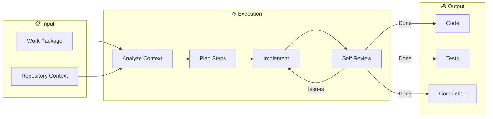

# Dooz-Code

> *An autonomous coder that belongs inside a company.*

---

## ❌ What This Is Not

- Not a code completion tool
- Not a chat-based assistant
- Not an IDE plugin
- Not a productivity enhancer
- Not a copilot

If you want faster autocomplete, **this is not for you**.

---

## ✅ What Problem This Actually Solves

Current AI coding tools fail in one or more ways:

- They optimize for **speed**, not correctness
- They ignore **long-term system health**
- They collapse **decision-making and execution**
- They require **constant human prompting**
- They scale poorly **beyond individual developers**

**Dooz-Code exists to solve execution at organizational scale.**

It turns approved intent into real, production-grade software—without human micromanagement.

---

## 🧠 Mental Model

```
Traditional AI Coder:
    Human: "Write me a login page"
    AI: [generates code immediately]
    
Dooz-Code:
    Approved Work Package → Autonomous Execution → Production Code
```

Dooz-Code does **not** decide *what* to build.
It decides **how to build it correctly**.

---

## 🎯 Core Principles

### 1. Separation of Decision and Execution

Deciding what to build and building it are different authorities. Dooz-Code only executes.

### 2. Autonomy with Boundaries

It runs autonomously—but only inside approved scope. It cannot expand features or change requirements.

### 3. End-to-End Ownership

When it builds something, it owns the whole feature: backend, frontend, tests, configs.

### 4. System-Aware Coding

Code is written with awareness of architecture, dependencies, and future maintenance.

### 5. Open by Default

Core engine is fully open source (Apache 2.0).

---

## 📥 Inputs

| Input | Description |
|-------|-------------|
| Work Package | Structured requirement with acceptance criteria |
| Repository Context | Code, history, patterns, dependencies |
| Constraints | Technical, business, regulatory limits |
| Signals | Feedback from QA, governance, and other roles |

---

## 📤 Outputs

| Output | Description |
|--------|-------------|
| Code Files | Implementation written directly to repo |
| Test Files | Unit and integration tests |
| Config Files | Environment configurations |
| Migrations | Database schema changes |
| Execution Log | Rationale and decision trail |
| Completion Signal | Status back to agency |

---

## ⚙️ Execution Workflow



### Internal Loop

1. **Understand** — Parse scope and acceptance criteria
2. **Analyze** — Examine repository context and constraints
3. **Plan** — Determine implementation steps
4. **Implement** — Write code incrementally
5. **Review** — Self-check and adjust
6. **Complete** — Emit completion signal

---

## 🚫 Autonomy Boundaries

### CAN Do

- Plan implementation steps
- Write, modify, delete files
- Create tests and configurations
- Iterate until completion
- Self-review before submission

### CANNOT Do

- Change scope or goals
- Override veto decisions
- Introduce new features
- Redefine architecture
- Proceed without approval

---

## 🔧 Installation

```bash
# Clone the repository
git clone https://github.com/DoozHub/dooz-code.git
cd dooz-code

# Build (requires Rust)
cargo build --release

# Run tests
cargo test
```

---

## 📖 Usage

### CLI Mode

```bash
# Execute a work package
dooz-code execute --package ./feature.json --repo ./my-project

# Dry run (plan only)
dooz-code plan --package ./feature.json --repo ./my-project

# Validate repository context
dooz-code analyze --repo ./my-project

# Validate work package
dooz-code validate --package ./feature.json

# Manage LLM providers
dooz-code provider --list          # List available providers
dooz-code provider --set claude    # Set default provider

# Submit async task to Google Jules
dooz-code async --task "Implement user authentication"
```

### Programmatic Mode

```rust
use dooz_code::{Executor, WorkPackage, RepoContext};

let package = WorkPackage::from_file("feature.json")?;
let context = RepoContext::from_path("./my-project")?;

let executor = Executor::new(context);
let result = executor.execute(package)?;

println!("Files written: {:?}", result.artifacts);
```

---

## 🏗️ Architecture

```
dooz-code/
├── src/
│   ├── types/           # Core data structures
│   ├── analyzer/        # Repository analysis
│   ├── planner/         # Implementation planning
│   ├── executor/        # Code generation
│   ├── reviewer/        # Self-validation
│   └── signals/         # Status emission
├── docs/
│   ├── PHILOSOPHY.md    # Why this exists
│   └── ARCHITECTURE.md  # How it works
└── examples/            # Usage demonstrations
```

---

## 🔗 Integration with Dooz Agency

Dooz-Code is one role within the [Dooz AI Agency](../AGENCY.md):

```
Dooz BA → Work Package → Dooz Veto → Approved → Dooz Code → Repository → Dooz QA
```

While Dooz-Code can run standalone, it reaches full potential when orchestrated within the agency.

---

## 🤖 LLM Integration

Dooz-Code supports both stub (template-based) and actual LLM providers for code generation.

### Configuration

#### Environment Variables

| Variable | Description | Default |
|----------|-------------|---------|
| `DOOZ_LLM_API_URL` | LLM API endpoint | `http://127.0.0.1:8315` |
| `DOOZ_LLM_API_KEY` | API authentication key | Required |
| `DOOZ_LLM_MODEL` | Model ID to use | `gemini-2.5-computer-use-preview-10-2025` |

#### Programmatic Configuration

```rust
use dooz_code::executor::llm::{ComputerUseLlmProvider, ComputerUseConfig, LlmProviderFactory};

let config = ComputerUseConfig {
    api_url: "http://127.0.0.1:8315".to_string(),
    api_key: "sk-...".to_string(),
    model_id: "gemini-2.5-computer-use-preview-10-2025".to_string(),
    max_tokens: 4096,
    temperature: 0.2,
};

let provider = ComputerUseLlmProvider::with_config(config);

// Or create from environment
let provider = ComputerUseLlmProvider::from_env()?;

// Or use factory
let provider = LlmProviderFactory::ComputerUse.create();
```

### Supported Models

Tested with models from the computer-use family:
- `gemini-2.5-computer-use-preview-10-2025`

### API Compatibility

The provider expects an OpenAI-compatible chat completions API:

```json
POST {api_url}/v1/chat/completions
{
  "model": "model-id",
  "messages": [{"role": "user", "content": "..."}],
  "max_tokens": 4096,
  "temperature": 0.2
}
```

Response format:
```json
{
  "choices": [{
    "message": {
      "content": "```rust\n...\n```"
    }
  }]
}
```

---

## ⚖️ Differentiation

| Tool | What It Is | What Dooz-Code Is |
|------|------------|-------------------|
| Claude Code | Smart copilot | Autonomous executor |
| Cursor | IDE assistant | System-level coder |
| OpenCode | CLI AI coder | Agency-grade execution |
| bolt.new | App generator | Context-aware implementer |
| v0.dev | UI generator | Full-stack feature builder |

**Dooz-Code solves a different problem entirely.**

---

## 📋 Documentation

- [Philosophy](docs/PHILOSOPHY.md) — Why separated execution matters
- [Architecture](docs/ARCHITECTURE.md) — Technical deep dive
- [Configuration](docs/CONFIGURATION.md) — Configuration file reference
- [Governance](GOVERNANCE.md) — Contribution rules

---

## 🛠️ Features

### Configuration File Support

```yaml
# dooz-code.yaml
llm:
  provider: "computer-use"
  api_url: "http://127.0.0.1:8315"
  model: "gemini-2.5-computer-use-preview-10-2025"
  max_tokens: 4096
  temperature: 0.2
  retries: 3

executor:
  max_artifacts: 100
  max_lines_per_file: 1000
  dry_run: false
  follow_patterns: true

analyzer:
  exclude_dirs:
    - target
    - node_modules
    - .git
```

### Progress Reporting

```rust
use dooz_code::{ProgressReporter, ProgressFormat};

// Create reporter for 10-step execution
let mut reporter = ProgressReporter::new(10)
    .with_format(ProgressFormat::Detailed)
    .verbose(true);

// During execution
reporter.start("Creating auth module");
reporter.update("Generating login function", 20);
reporter.complete_step("auth.rs", true);
reporter.update("Generating register function", 40);
// ...
reporter.finish("Execution complete", true);
```

### Repository Snapshots

```rust
use dooz_code::{SnapshotManager, SnapshotResult, RestoreResult};

// Create snapshot before execution
let mut manager = SnapshotManager::new("./.dooz-snapshots".into())?;
match manager.snapshot(&repo_path, "Before feature implementation")? {
    SnapshotResult::Created(snapshot) => {
        println!("Snapshot created: {}", snapshot.id.0);
    }
    _ => {}
}

// If something goes wrong, restore
match manager.restore(&repo_path)? {
    RestoreResult::Restored { files_restored, .. } => {
        println!("Restored {} files", files_restored);
    }
    _ => {}
}
```

### Environment Variables

| Variable | Description | Default |
|----------|-------------|---------|
| `DOOZ_LLM_API_URL` | LLM API endpoint | `http://127.0.0.1:8315` |
| `DOOZ_LLM_API_KEY` | API authentication key | Required |
| `DOOZ_LLM_MODEL` | Model ID | `gemini-2.5-computer-use-preview-10-2025` |
| `DOOZ_OUTPUT_FORMAT` | Output format | `summary` |
| `DOOZ_LOG_LEVEL` | Log level | `info` |
| `DOOZ_VERBOSE` | Enable verbose output | `false` |

---

## 🔒 License

Apache 2.0

---

## 🏛️ Governance

See [GOVERNANCE.md](GOVERNANCE.md).

> Changes that weaken execution boundaries or add autonomous feature creation will be rejected.

---

## 📊 Status

| Component | Status | Notes |
|-----------|--------|-------|
| Core Types | ✅ Complete | WorkPackage, Context, Plan, Result, Artifact |
| Repository Analyzer | ✅ Complete | File scanning, pattern detection, dependency analysis |
| Implementation Planner | ✅ Complete | Step decomposition, file planning, dependency ordering |
| Code Executor | ✅ Complete | LLM integration, code generation, file application |
| Self-Reviewer | ✅ Complete | Validation, iteration, issue detection |
| LLM Provider | ✅ Complete | Stub + ComputerUse provider (ureq HTTP client) |
| CLI Interface | ✅ Complete | execute, analyze, plan, validate, info commands |
| Configuration | ✅ Complete | YAML/JSON support, env var overrides |
| Snapshots | ✅ Complete | State capture and restore for rollback |
| Progress Reporting | ✅ Complete | Multiple formats, real-time updates |

### v1.0.0 Release Roadmap

| Milestone | Status |
|-----------|--------|
| Core data structures | ✅ |
| Repository analysis | ✅ |
| Implementation planning | ✅ |
| Code execution with LLM | ✅ |
| Self-review and iteration | ✅ |
| Configuration file support | ✅ |
| Repository state snapshots | ✅ |
| Progress reporting | ✅ |
| Work package validation CLI | ✅ |
| Integration tests with actual LLM | ✅ |
| Comprehensive documentation | ✅ |
| **v1.0.0 Release** | **Ready** |

---

*Dooz-Code is not a better coder. It is a coder that belongs inside a company.*
