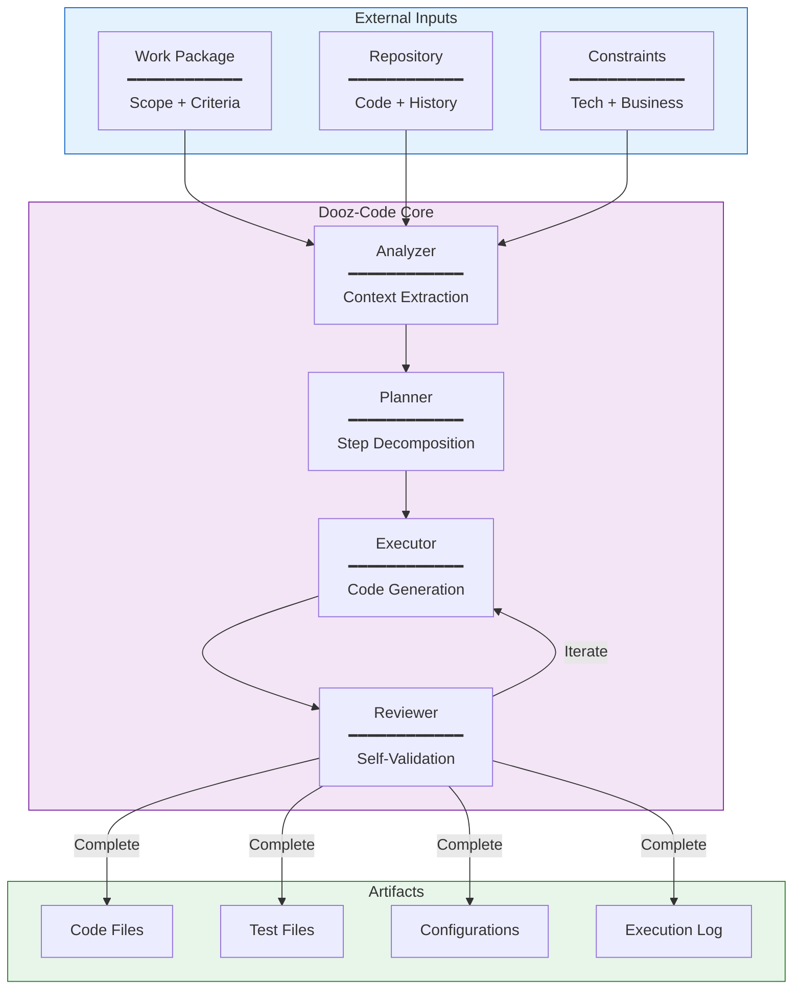
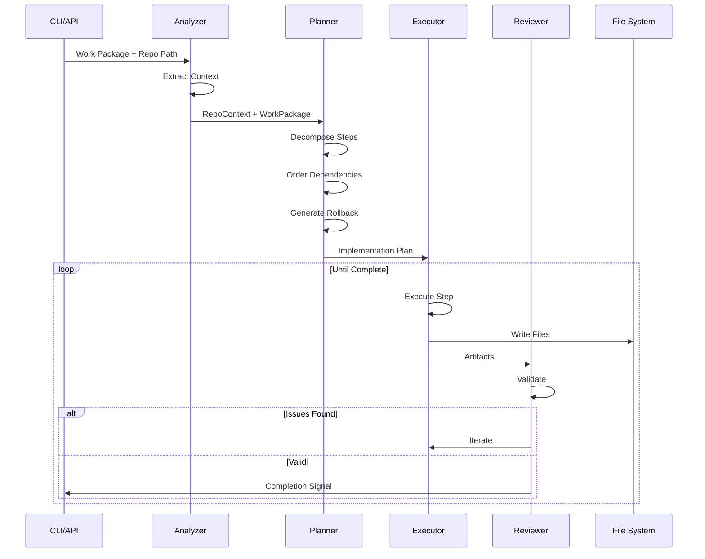

# Architecture

> *A deterministic execution engine for approved work packages.*

---

## System Overview



---

## Component Details

### Analyzer

**Purpose:** Extract full context from repository and work package.

**Inputs:**
- Work package JSON/YAML
- Repository file system
- Git history
- Constraint declarations

**Outputs:**
- File dependency graph
- Pattern catalog
- Convention analysis
- Integration points

**Key Functions:**
```rust
fn analyze_repository(path: &Path) -> RepoContext;
fn parse_work_package(source: &str) -> WorkPackage;
fn extract_constraints(context: &RepoContext) -> Constraints;
fn identify_patterns(context: &RepoContext) -> Vec<Pattern>;
```

---

### Planner

**Purpose:** Decompose work package into implementation steps.

**Inputs:**
- Analyzed repository context
- Parsed work package
- Extracted constraints

**Outputs:**
- Ordered list of implementation steps
- File modification plan
- Test generation plan
- Rollback strategy

**Key Functions:**
```rust
fn plan_implementation(package: &WorkPackage, context: &RepoContext) -> Plan;
fn order_steps(steps: Vec<Step>) -> Vec<Step>;
fn generate_rollback(plan: &Plan) -> RollbackPlan;
fn estimate_complexity(plan: &Plan) -> ComplexityScore;
```

**Planning Guarantees:**
- Steps are idempotent where possible
- Dependencies are respected
- Rollback is always possible

---

### Executor

**Purpose:** Generate code according to the implementation plan.

**Inputs:**
- Implementation plan
- Repository context
- Pattern catalog

**Outputs:**
- Modified/new files
- Test files
- Configuration changes
- Migration scripts

**Key Functions:**
```rust
fn execute_step(step: &Step, context: &mut Context) -> StepResult;
fn generate_code(spec: &CodeSpec, patterns: &[Pattern]) -> String;
fn apply_changes(changes: Vec<Change>, repo: &mut Repository) -> Result<()>;
fn create_tests(implementation: &Implementation) -> Vec<TestFile>;
```

**Execution Guarantees:**
- No scope expansion
- Pattern consistency
- Convention adherence
- Incremental progress

---

### Reviewer

**Purpose:** Validate generated code before completion.

**Inputs:**
- Generated artifacts
- Acceptance criteria
- Test specifications

**Outputs:**
- Validation result
- Issue list (if any)
- Iteration request (if issues)
- Completion signal (if valid)

**Key Functions:**
```rust
fn validate_acceptance(artifacts: &[Artifact], criteria: &[Criterion]) -> ValidationResult;
fn check_patterns(artifacts: &[Artifact], patterns: &[Pattern]) -> PatternCheck;
fn run_static_analysis(artifacts: &[Artifact]) -> AnalysisResult;
fn determine_completion(validation: &ValidationResult) -> CompletionStatus;
```

**Review Guarantees:**
- All acceptance criteria checked
- Pattern violations detected
- Iteration until valid

---

## Data Structures

### Work Package

```rust
pub struct WorkPackage {
    /// Unique identifier
    pub id: PackageId,
    
    /// Human-readable title
    pub title: String,
    
    /// Detailed description
    pub description: String,
    
    /// Acceptance criteria
    pub criteria: Vec<AcceptanceCriterion>,
    
    /// Technical constraints
    pub constraints: Vec<Constraint>,
    
    /// Scope boundaries
    pub scope: Scope,
    
    /// Approval reference
    pub approval: ApprovalRef,
}
```

### Repository Context

```rust
pub struct RepoContext {
    /// Root path
    pub path: PathBuf,
    
    /// File index
    pub files: FileIndex,
    
    /// Dependency graph
    pub dependencies: DependencyGraph,
    
    /// Detected patterns
    pub patterns: Vec<Pattern>,
    
    /// Git history
    pub history: GitHistory,
    
    /// Conventions
    pub conventions: Conventions,
}
```

### Implementation Plan

```rust
pub struct Plan {
    /// Ordered steps
    pub steps: Vec<Step>,
    
    /// Files to modify
    pub file_plan: FilePlan,
    
    /// Tests to generate
    pub test_plan: TestPlan,
    
    /// Rollback strategy
    pub rollback: RollbackPlan,
    
    /// Estimated complexity
    pub complexity: ComplexityScore,
}
```

### Execution Result

```rust
pub struct ExecutionResult {
    /// Status
    pub status: ExecutionStatus,
    
    /// Generated artifacts
    pub artifacts: Vec<Artifact>,
    
    /// Execution log
    pub log: ExecutionLog,
    
    /// Time elapsed
    pub duration: Duration,
    
    /// Iteration count
    pub iterations: u32,
}
```

---

## Execution Flow



---

## Error Handling

### Recoverable Errors

| Error | Recovery |
|-------|----------|
| File conflict | Retry with merge strategy |
| Pattern mismatch | Adapt to local convention |
| Test failure | Iterate on implementation |
| Syntax error | Self-correct and retry |

### Unrecoverable Errors

| Error | Response |
|-------|----------|
| Scope violation | Halt and report |
| Constraint breach | Halt and report |
| Context failure | Halt and report |
| Approval missing | Halt and report |

---

## Determinism Guarantees

1. **Same input → Same plan** — Planning is deterministic
2. **Same plan → Same output** — Execution is reproducible
3. **Full audit trail** — Every decision is logged
4. **No external calls during execution** — Isolated execution

---

## Integration Points

### Agency Integration

```rust
// Receive work package from orchestrator
let package = orchestrator.receive_work_package()?;

// Execute
let result = executor.execute(package)?;

// Report completion
orchestrator.report_completion(result)?;
```

### Standalone Usage

```rust
// Load from file
let package = WorkPackage::from_file("feature.json")?;
let context = RepoContext::from_path("./repo")?;

// Execute
let executor = Executor::new();
let result = executor.execute(package, context)?;
```

---

## Performance Characteristics

| Operation | Complexity | Notes |
|-----------|------------|-------|
| Context extraction | O(n) | n = number of files |
| Dependency analysis | O(n log n) | Optimized graph traversal |
| Planning | O(k) | k = number of steps |
| Execution | O(k × m) | m = average step complexity |
| Validation | O(c) | c = number of criteria |

---

## Future Extensions

- **Cross-repository execution** — Multi-repo feature implementation
- **Learning from history** — Pattern improvement over time
- **Parallel execution** — Independent step parallelization
- **Distributed execution** — Scale across machines

---

*Architecture serves execution. Execution serves stability.*
